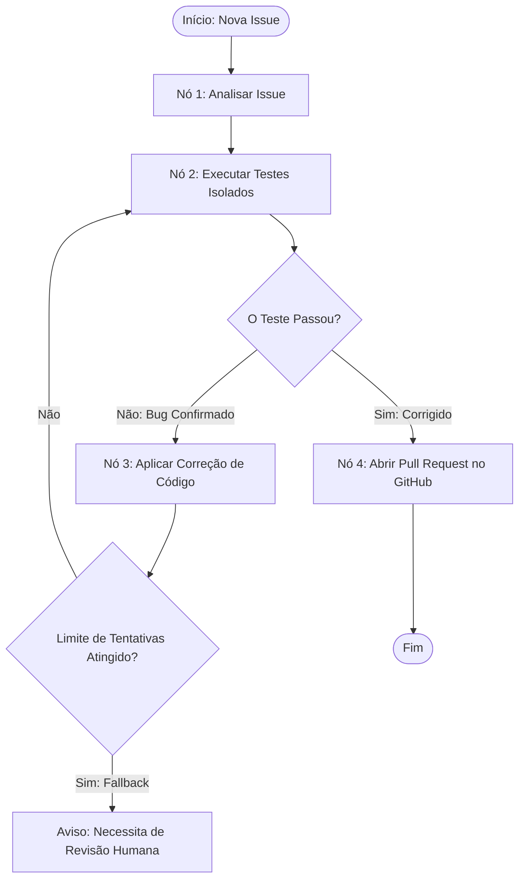

# Agente de IA Autônomo para Triagem de Repositórios e Autocorreção de Bugs

Um sistema Multiagente autônomo construído com **LangGraph** e **Google Gemini** que monitora repositórios de código, cria ambientes seguros isolados via Docker para reproduzir falhas através de suítes de testes e aplica correções cirúrgicas no código de forma totalmente autônoma.

---

## Arquitetura do Sistema (Fluxo de Raciocínio)

O fluxo cognitivo do agente é modelado como um Grafo de Estados utilizando o LangGraph. Isso permite roteamento determinístico, ciclos de repetição (loops de tentativa e erro para depuração) e gerenciamento de memória centralizado.



---

## Stack Técnica e Decisões de Arquitetura

*   **Orquestração**: `LangGraph` - Escolhido em detrimento das cadeias lineares tradicionais do LangChain por permitir fluxos cíclicos (loops de correção -> teste -> re-teste) sem estourar a pilha de execução.
*   **Motor Cognitivo**: `Google Gemini 2.5 Flash` - Configurado com temperatura extremamente baixa (`0.05` / `0.1`) e saídas estruturadas em JSON (`response_format`) para garantir respostas previsíveis e livres de alucinações de texto.
*   **Isolamento de Execução (Sandbox)**: `Docker` - O uso de containers efêmeros (`--rm`) garante que qualquer código gerado pela IA seja executado sem afetar a máquina servidora.
*   **Validação de Código**: `Pytest` - Engine de testes padrão de mercado utilizada para avaliar o sucesso ou falha através de códigos de saída de sistema (`returncode == 0`).

---

## Guardrails de Produção e Segurança

1.  **Mitigação de Injeção de Prompt e Execução de Código Remoto (RCE)**: Permitir que uma IA altere e execute códigos diretamente em um servidor real é perigoso. Montar os volumes de forma dinâmica no Docker isola o ambiente. Qualquer código malicioso gerado por prompts de usuários é destruído assim que o container encerra.
2.  **Resiliência a Limites de Taxa (HTTP 429)**: Mecanismos automatizados de tentativa e pausa (*exponential backoff/retry*) foram integrados no Nó 1 para lidar com as cotas do Google AI Studio de forma fluida.
3.  **Proteção contra Loops Infinitos**: Contadores rígidos de iterações (`max_iterations = 5`) e limites de tempo em subprocessos (`timeout = 25s`) impedem processos travados e gastos astronômicos de tokens de API.

---

## Como Executar o Projeto

### Pré-requisitos
*   Python 3.11+
*   Docker Desktop rodando em segundo plano
*   Chave de API do Google AI Studio

### Instalação e Preparação
1. Clone o repositório e navegue até a pasta:
   ```bash
   git clone <link-do-seu-repositorio>
   cd agente_bugs
   ```
2. Crie e ative o ambiente virtual:
   ```bash
   python -m venv venv
   source venv/bin/activate  # No Windows use `.\venv\Scripts\Activate.ps1`
   ```
3. Instale as dependências necessárias:
   ```bash
   pip install langgraph langchain-core langchain-google-genai python-dotenv pytest
   ```
4. Configure suas credenciais em um arquivo `.env` na raiz:
   ```env
   GOOGLE_API_KEY=sua_chave_do_gemini_aqui
   ```

### Execução
Execute a pipeline do sistema através do comando:
```bash
python main.py
```
O agente lerá o código com falha, capturará o `ZeroDivisionError` no Docker, reescreverá a `calculadora.py` de forma autônoma, aguardará a sincronização e alcançará o estado final de sucesso!
